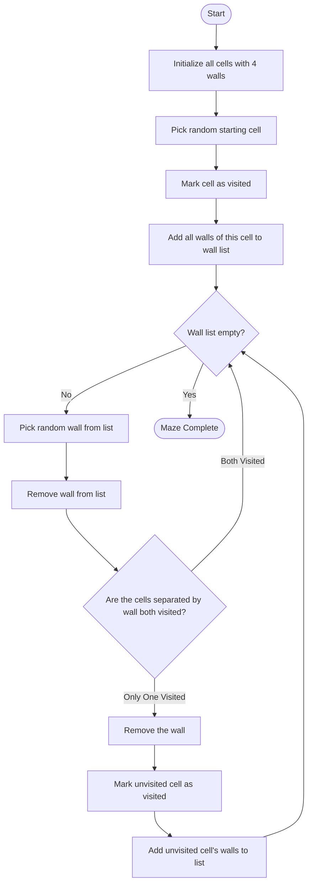
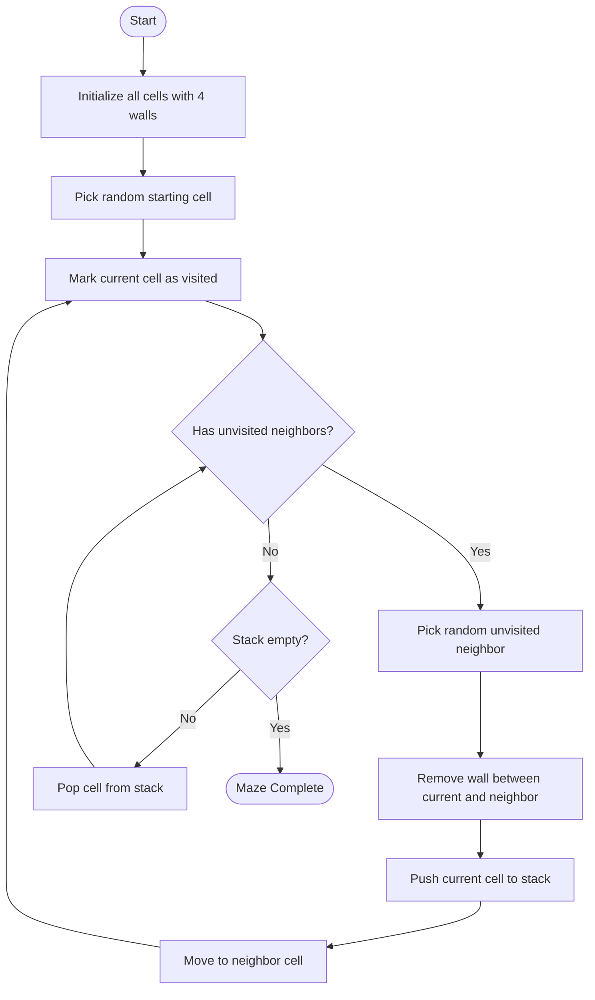
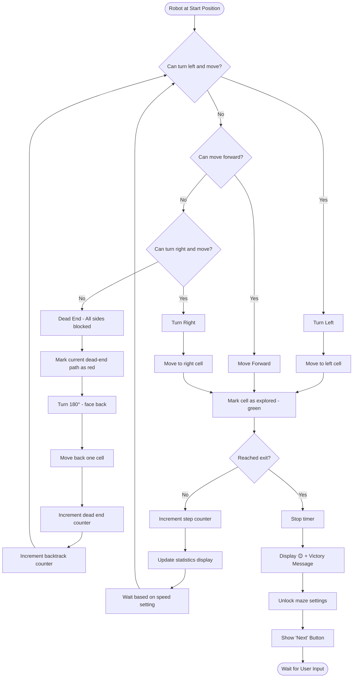
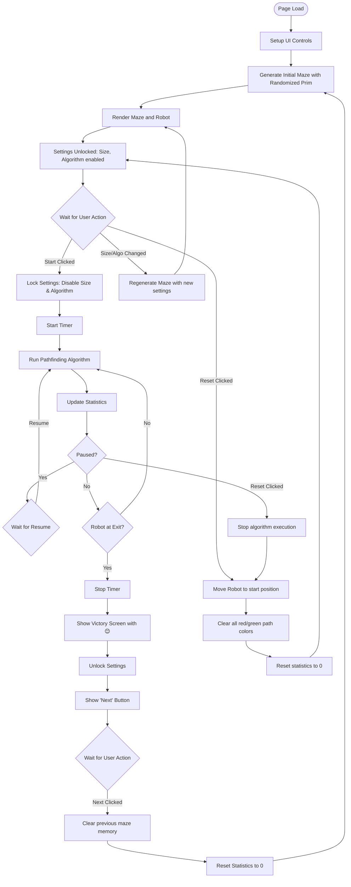

# Robot Maze Game - Technical Plan

## Overview
A web-based game where a robot navigates through randomly generated mazes using pathfinding algorithms. The game features configurable maze generation, adjustable robot speed, and visual feedback of the exploration process.

## Core Features

### 1. Maze Configuration
- **Size**: Configurable grid (default: 10x10)
- **Coordinate System**: Grid uses (row, col) notation starting at (0,0) in top-left corner
  - First row: (0,0), (0,1), (0,2), ..., (0,n)
  - Second row: (1,0), (1,1), (1,2), ..., (1,n)
- **Start Position**: Bottom-left corner - for 10x10 grid: (9, 0)
- **Exit Position**: Top-right corner - for 10x10 grid: (0, 9)
- **Exit Marker**: Open door emoji (🚪)
- **Generation**: Random generation with exactly one valid path
- **Maze Generation Algorithms Available**:
  - Randomized Prim's Algorithm (default)
  - Recursive Backtracking
  - Kruskal's Algorithm

### 2. Robot Mechanics
- **Starting Position**: Bottom-left corner (9, 0) for 10x10 grid
- **Initial Orientation**: Facing up (toward exit) unless blocked, then facing first available left-most opening
- **Visual Representation**: Robot emoji (🤖) initially, can be replaced with 8-bit sprites later
- **Orientation States**: Four directional states (up, down, left, right)
- **Movement**: Smooth sliding animation between cells
- **Visual Style**: Simple emoji initially, 8-bit retro sprite design for future enhancement

### 3. Pathfinding Algorithm (True Left-Hand Wall Following)
**Algorithm**: Always keep your "left hand on the wall" - this guarantees finding the exit in any maze with one solution.

**Priority order for exploration** (checked every step):
1. **Left** (turn left relative to current direction and check if can move)
2. **Forward** (continue in current direction if can move)
3. **Right** (turn right relative to current direction and check if can move)
4. **Backward** (turn 180° - dead end, must backtrack)

**How it works**:
- At each cell, robot first attempts to turn left and move
- If left is blocked, try moving forward
- If forward is blocked, try turning right and moving
- If all three are blocked, it's a dead end - turn around and backtrack

### 4. Visual Feedback
- **Walls**: Thick black blocks
- **Paths**: White spaces between blocks
- **Explored Path**: Green colored cells (successfully explored paths)
- **Dead End Paths**: Red colored cells
  - **Rule**: Only cells that robot explored but led to a dead end are marked red
  - **Revisiting**: If robot revisits a cell from a different route and that route does NOT end in a dead end, mark it green (overrides previous red)
  - **Logic**: Red = "this specific path segment led nowhere", Green = "this is part of active/successful exploration"
- **Robot**: Robot emoji (🤖) initially
- **Exit**: Door emoji (🚪)

### 5. User Controls
- **Maze Size Input**: Numeric input (min: 5, max: 100)
  - Locked during exploration (disabled when robot is running)
- **Algorithm Selector**: Dropdown menu (Randomized Prim, Recursive Backtracking, Kruskal)
  - Locked during exploration (disabled when robot is running)
- **Speed Control**: Slider (1-100, where 1=slowest at 1 step/second, 100=fastest at 100 steps/second)
  - Range: 1 step/sec (1000ms delay) to 100 steps/sec (10ms delay)
  - Can be adjusted during exploration
- **Start Button**: Initiates robot exploration, locks settings
- **Pause/Resume Button**: Toggles exploration, keeps settings locked
- **Reset Button**: Stops exploration, returns robot to start position, unlocks settings, keeps current maze
- **Credits Button**: Displays project information modal with author details and development process
- **Next Button**: Appears on completion, generates new maze with current settings, unlocks settings

### 6. Statistics Display
- Steps Taken
- Dead Ends Encountered
- Time Elapsed
- Current Algorithm

### 7. Win Condition
- Robot reaches top-right exit
- Display: Happy face emoji (😊) + congratulatory message
- "Next" button appears to generate new maze

## Technical Architecture

For detailed implementation specifications, class structures, and step-by-step task breakdown, see:
**[maze-game-implementation.md](maze-game-implementation.md)**

### File Structure Overview
```
robo-maze/
├── index.html          # Main HTML structure
├── css/
│   └── style.css       # Styling and layout
├── js/
│   ├── main.js         # Application entry point & GameController
│   ├── maze.js         # Maze & Cell classes, generation algorithms
│   ├── robot.js        # Robot class and pathfinding logic
│   ├── renderer.js     # Canvas rendering
│   └── ui.js           # UI controls and event handlers
└── docs/
    ├── maze-game-plan.md            # This file (high-level plan)
    └── maze-game-implementation.md   # Detailed implementation guide
```

### Core Components Summary
1. **Cell Class** - Represents individual maze cells with walls and state
2. **Maze Class** - Grid management and maze generation algorithms (Prim, Backtracking, Kruskal)
3. **Robot Class** - Position tracking, pathfinding logic, statistics
4. **Renderer Class** - Canvas-based visualization with animations
5. **UIController Class** - DOM manipulation and event handling
6. **GameController Class** - Main game orchestration and flow control

## Algorithm Workflows

### Maze Generation - Randomized Prim's Algorithm (Default)



### Maze Generation - Recursive Backtracking



### Robot Pathfinding - True Left-Hand Wall Following



### Game Flow



## UI Layout

```
┌─────────────────────────────────────────────────────────────┐
│                     ROBOT MAZE SOLVER                       │
├─────────────────────────────────────────────────────────────┤
│  Controls:                                                  │
│  [Maze Size: 10  ] [Algorithm: Prim ▼] [Speed: 5 ═════○══ ]│
│  [Start] [Pause] [Reset]                                   │
├─────────────────────────────────────────────────────────────┤
│  Statistics:                                                │
│  Steps: 0 | Dead Ends: 0 | Backtracks: 0 | Time: 0.0s     │
├─────────────────────────────────────────────────────────────┤
│                                                             │
│   ┌───────────────────────────────────────┐                │
│   │                                    🚪 │  (exit - door) │
│   │    ███  ███████  ███  ███            │                │
│   │        ███     ███  ███  ███         │                │
│   │    ███████ ███ ███ ███ █████         │                │
│   │    ███            ███        ███      │                │
│   │    ███ ███████ ███████ ███ █████     │                │
│   │        ███          ███ ███          │                │
│   │ 🤖 ███ ███████████████  ███          │  (start-robot) │
│   │                                       │                │
│   └───────────────────────────────────────┘                │
│                  (HTML Canvas Element)                      │
└─────────────────────────────────────────────────────────────┘

Note: Canvas dynamically resizes based on maze size for optimal performance
```

## Implementation Overview

For detailed task breakdown with testing criteria, implementation code, and optimal ordering, see:
**[maze-game-implementation.md](maze-game-implementation.md)**

### Implementation Summary

The implementation is broken down into **20 detailed tasks** spanning approximately **35-40 hours** of development work:

1. **Tasks 1-2**: Project setup, HTML structure, and CSS styling
2. **Tasks 3-7**: Core data structures (Cell, Maze) and maze generation algorithms
3. **Tasks 8-9**: Robot class and pathfinding logic
4. **Tasks 10-13**: Canvas rendering and animation system
5. **Tasks 14-16**: UI controls and game loop implementation
6. **Tasks 17-20**: Integration testing, polish, documentation, and deployment

Each task includes:
- ✅ Clear subtasks and dependencies
- ✅ Complete implementation code
- ✅ Specific testing criteria
- ✅ Expected completion time

## Key Design Decisions

### Cell State Management
The game uses a smart cell coloring system:

1. **Initial State**: All cells are white (unexplored)
2. **Green Cells**: Cells currently being explored or part of successful path
   - Robot marks cell green when entering it
3. **Red Cells**: Cells that led to a dead end
   - When robot backtracks from a dead end, mark those cells red
   - **Important**: Only the specific path segment that led nowhere turns red
4. **Override Rule**: If robot revisits a red cell via a different route:
   - If the new path does NOT end in a dead end → turn cell green (override red)
   - This shows that while one approach failed, another succeeded

### Coordinate System Details
- **Grid Notation**: (row, col) where row increases downward, col increases rightward
- **Origin**: (0, 0) is top-left corner
- **Example 10x10 grid**:
  - Top-left: (0, 0)
  - Top-right: (0, 9) ← EXIT 🚪
  - Bottom-left: (9, 0) ← START 🤖
  - Bottom-right: (9, 9)

### Settings Lock Mechanism
- **When Locked** (during exploration):
  - Maze Size input: disabled
  - Algorithm selector: disabled
  - Speed slider: enabled (can adjust)
  - Start button: disabled
  - Pause button: enabled
  - Reset button: enabled
- **When Unlocked** (before start or after completion):
  - All controls enabled except Pause
  - Changing size or algorithm regenerates maze immediately

## Technical Specifications Summary

Full technical specifications are available in [maze-game-implementation.md](maze-game-implementation.md).

### Key Technologies
- **Rendering**: HTML5 Canvas (800x800px base, dynamically scaled)
- **Animation**: requestAnimationFrame (60fps target)
- **Language**: Vanilla JavaScript ES6+
- **Styling**: CSS Grid and Flexbox
- **Dependencies**: None (pure vanilla implementation)

### Performance Targets
- **Maze Generation**: < 1 second for 100x100 maze
- **Animation**: Smooth 60fps movement
- **Memory**: Proper cleanup between maze generations
- **Browser Support**: Modern browsers (Chrome, Firefox, Safari, Edge)

## Future Enhancements (Optional)
- Multiple pathfinding algorithms (A*, Dijkstra, BFS, DFS)
- Difficulty levels with configurable dead-end density
- Sound effects and audio feedback
- High score tracking and leaderboards
- Maze export/import (JSON format)
- Mobile touch controls and gestures
- Different visual themes (neon, retro, minimal)
- 8-bit sprite graphics for robot

## Success Criteria
- ✅ Maze generates correctly with exactly one path
- ✅ Robot successfully navigates to exit every time
- ✅ Visual feedback is clear and intuitive
- ✅ Controls are responsive and user-friendly
- ✅ Performance is smooth at all speed settings
- ✅ Code is modular and maintainable

---

## Summary of Changes from Initial Review

### ✅ Fixed Critical Issues:
1. **Algorithm Corrected**: Changed to TRUE left-hand wall following (Left → Forward → Right → Back)
2. **Typo Fixed**: "Generatrion" → "Generation"
3. **Coordinate System Clarified**: (row, col) notation, (0,0) at top-left
4. **Cell State Logic**: Clear rules for red/green marking with override capability
5. **Default Algorithm**: Changed to Randomized Prim's (better maze structure)

### ✅ Enhanced Features:
1. **Reset Button**: Added to return robot to start without regenerating maze
2. **Settings Lock**: Prevents maze/algorithm changes during exploration
3. **Canvas Rendering**: Better performance than CSS Grid
4. **Memory Management**: Explicit cleanup between mazes
5. **Enhanced Statistics**: Added backtrack counter
6. **Emojis**: Robot (🤖) and Door (🚪) for clear visuals
7. **Speed Clarification**: 1 = slowest (1 step/sec), 10 = fastest (10 steps/sec)

### ✅ Improved Architecture:
1. **Complete Class Methods**: All classes now have full method definitions
2. **Optimized Data Structures**: Set for visited cells, array for current path
3. **Direction Helpers**: Dedicated methods for left/right/back calculations
4. **Better Robot State**: Tracks position, direction, visited cells, backtracks
5. **Renderer Enhancement**: Canvas-based with dynamic sizing and emoji support

### 📊 Complete Workflow Diagrams:
- ✅ Randomized Prim's Algorithm (default)
- ✅ Recursive Backtracking Algorithm
- ✅ True Left-Hand Wall Following
- ✅ Complete Game Flow with Reset and Settings Lock

---

## Next Steps

**Ready to start implementing?** Follow the detailed task guide:

📖 **[Open maze-game-implementation.md](maze-game-implementation.md)**

The implementation guide provides:
- 20 sequenced tasks with clear dependencies
- Complete code for each component
- Testing criteria for validation
- Estimated time for each task
- Build and deployment instructions

**Estimated Total Development Time**: 35-40 hours (5-7 days at 6-8 hours/day)

**Recommended Approach**:
1. Start with Task 1 (HTML Structure)
2. Complete each task sequentially
3. Test thoroughly before moving to next task
4. Use the provided test scripts for validation
5. Track progress using the task checkboxes
